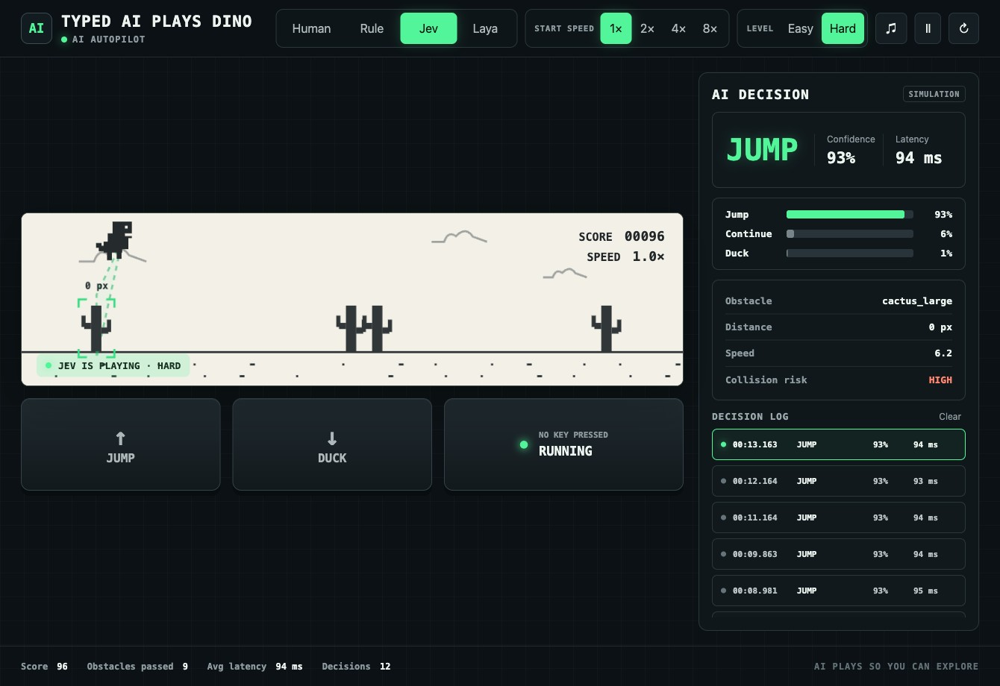
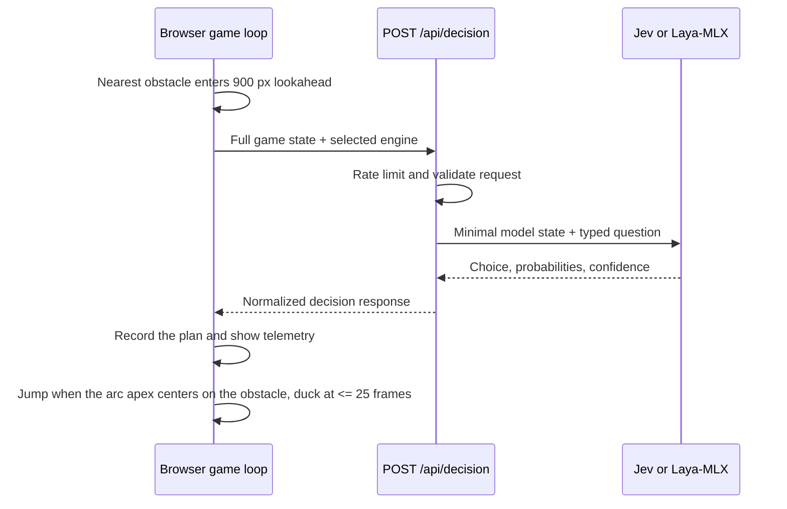

# Typed AI Plays Dino

Typed AI Plays Dino is a browser game where either [TypeSafe AI](https://typesafe.ai/)'s Jev API or the local [Laya-MLX](https://github.com/mizorewww/laya-mlx) runtime controls an original pixel dinosaur. Both engines receive the same structured game state and choose whether to jump, duck, or continue. The interface shows every decision, probability, confidence score, input, and latency in real time.



## Features

- Four play modes: Human, deterministic Rule bot, Jev API, and local Laya-MLX.
- Two difficulties. Easy shows one single cactus or bird at a time. Hard spawns clumps of two or three cacti and keeps two obstacles on screen.
- Typed Jev decisions with visible probabilities, confidence, collision risk, and latency.
- Starting-speed presets at `1x`, `2x`, `4x`, and `8x`; every run continues accelerating from the selected starting speed.
- Pixel-style sound effects implemented with the Web Audio API.
- Responsive two-panel interface with the game on the left and the decision log on the right.
- Simulation fallback when no TypeSafe API key is configured.
- A separate lightweight Python service that keeps Laya-MLX loaded on Apple Silicon.

## Requirements

- Go 1.22 or newer.
- A TypeSafe API key for live Jev decisions. The game still runs in simulation mode without one.
- For Laya mode: an Apple Silicon Mac, macOS 14+, and Python 3.11+. Laya-MLX does not run on Linux or Intel Macs.

## Run locally

Clone the repository and create your local environment file:

```bash
git clone https://github.com/chuongtrh/jev_plays_dino.git
cd jev_plays_dino
cp .env.example .env
```

Set your API key in `.env`:

```dotenv
TYPESAFE_API_KEY=your_typesafe_api_key
TYPESAFE_BASE_URL=https://api.typesafe.ai
LAYA_BASE_URL=http://127.0.0.1:8090
LAYA_API_KEY=
PORT=8080
```

Start the server:

```bash
go run .
```

Open <http://localhost:8080>. Values already exported in your shell take precedence over `.env`.

## Run Laya-MLX locally

Laya runs as a separate service so the Go application remains small and can switch decision engines at runtime. On an Apple Silicon Mac:

```bash
cd laya-server
python3.11 -m venv .venv
source .venv/bin/activate
pip install -r requirements.txt
cp .env.example .env
set -a
source .env
set +a
python server.py
```

The first start downloads the `aac6fef/laya-mlx` checkpoint. Later starts use the local Hugging Face cache. Keep this service running, start the Go application in another terminal, then choose **Laya** in the game.

The service binds to `127.0.0.1:8090` by default. To expose it to another machine, set `LAYA_HOST=0.0.0.0`, configure the same secret as `LAYA_SERVER_API_KEY` in the Python service and `LAYA_API_KEY` in the Go application, and protect the connection with a private network or TLS reverse proxy.

## Play modes

- **Human** — press `Space` or `Arrow Up` to jump and `Arrow Down` to duck.
- **Rule** — a deterministic local controller uses obstacle type, distance, and current speed.
- **Jev** — the Go server sends structured game state to Jev and returns a typed action.
- **Laya** — the Go server forwards the same state to a local Laya-MLX service; model weights and inference stay on your Mac.

The `1x`, `2x`, `4x`, and `8x` controls select the starting speed for the next run. Speed then increases gradually as the score grows, matching the original endless-runner behavior.

The **Easy** and **Hard** controls select the difficulty for the next run:

- **Easy** spawns one obstacle every 103 to 188 frames, so one single cactus or bird is on screen at a time.
- **Hard** spawns a wave every 55 to 80 frames. A wave is a single cactus, a clump of two or three cacti, or a bird. Seven in ten cactus waves add a trailing cactus at a gap the dinosaur clears in the same jump, so two obstacles share the screen at every speed preset. Clumps grow as speed stretches the jump arc, up to three cacti. The wave gap is measured in frames, so the spacing grows with speed while the jump arc stays clearable.

## How the project works

The application has three runtime layers:

- **Browser (`web/`)** — owns the game loop, physics, obstacle generation, rendering, controls, decision timing, and the inspector UI. It asks for one AI plan per obstacle when that obstacle is within the 900 px planning window.
- **Go server (`main.go`)** — embeds and serves the frontend, validates decision requests, rate-limits clients, selects the requested engine, and normalizes engine output into one response shape.
- **Decision engine** — either the hosted Jev endpoint, the optional local Laya-MLX service, or the deterministic Go simulation used when `TYPESAFE_API_KEY` is empty.

Human and Rule modes run entirely in the browser. Jev and Laya modes use the same browser-to-server API:



Planning and execution are deliberately separate. A returned `jump` or `duck` is stored on the live obstacle instead of being executed immediately. This gives the model enough network/inference time while preserving the late timing required by the game physics. The jump fires when the obstacle's collision span sits centered under the top of the arc, so a wide cactus clump, or a lead cactus plus its paired trailer, gets the full airtime. Responses from a previous game session, responses for obstacles that no longer exist, and responses arriving after an action ran are displayed when appropriate but never executed.

## Decision API

### `POST /api/decision`

The browser sends the selected engine and a snapshot of the nearest obstacle:

```json
{
  "engine": "jev",
  "speed": 8.42,
  "score": 42,
  "dino_state": "running",
  "time_to_collision_ms": 855,
  "obstacle": {
    "id": "obstacle-7",
    "type": "cactus_large",
    "count": 1,
    "distance": 432,
    "width": 36,
    "height": 66,
    "y": 324
  }
}
```

`engine` accepts `jev` or `laya`; an omitted value defaults to `jev`. The server requires a positive `speed` plus `obstacle.id` and `obstacle.type`. `obstacle.count` is the number of cacti in the clump, from 1 to 3, and `obstacle.width` covers the whole clump. Birds always report a count of 1. Request bodies are limited to 16 KiB and each client IP is limited to 180 requests per minute.

A successful response has the same shape for every engine:

```json
{
  "obstacle_id": "obstacle-7",
  "action": "jump",
  "probabilities": {
    "jump": 0.93,
    "duck": 0.01,
    "continue": 0.06
  },
  "confidence": 0.93,
  "latency_ms": 287,
  "engine": "jev"
}
```

Only `jump`, `duck`, and `continue` are valid actions. `latency_ms` in the API response is engine-side latency. The browser also measures end-to-end latency—from starting `fetch` through parsing the response—and uses that value in the UI and aggregate metrics.

The server returns:

- `400` for malformed input, missing game state, or an unknown engine.
- `429` when the per-IP rate limit is exceeded.
- `502` when the selected decision service fails or returns invalid data.

If the browser receives an error, it labels the entry `API ERROR` and creates a local fallback plan: jump for a cactus, duck for `bird_low`, and continue otherwise. If no `TYPESAFE_API_KEY` is configured, the Go server instead serves a deterministic simulation response with `engine: "simulation"`; this is a normal successful response, not an error fallback.

### `GET /api/health`

This endpoint reports the engines available to the UI. Jev is reported as `jev` when an API key exists and `simulation` otherwise. Laya is reported as `laya-mlx` only when its `/health` endpoint responds successfully within 600 ms.

## What is sent to the model

The full browser request is useful for validation, UI telemetry, and matching the answer to an obstacle, but the model receives only the signals needed to choose a maneuver:

```json
{
  "model": "jev-latest",
  "state": {
    "obstacle_type": "cactus_large",
    "time_to_collision_ms": 855,
    "dino_state": "running"
  },
  "questions": {
    "next_action": {
      "type": "choice",
      "instructions": "Select the maneuver for this obstacle.",
      "criteria": {
        "jump": "Ground cactus.",
        "duck": "Low bird.",
        "continue": "High bird."
      }
    }
  }
}
```

This is a typed question rather than a free-form chat prompt:

- `state` supplies the obstacle category, estimated collision time, and current dinosaur state.
- `questions.next_action.type = "choice"` constrains the task to the named criteria.
- `criteria` defines the meaning of each allowed choice: ground cactus → `jump`, low bird → `duck`, high bird → `continue`.
- Jev returns `answers.next_action.choice`, a probability for each choice, and a confidence score. The Go server validates the choice and maps those fields to the public decision response.

The Laya service constructs the same `state` and `questions` objects and passes them to `_agent.predict(...)`, so hosted and local inference solve the same typed task. Fields such as `score`, `speed`, obstacle dimensions, clump count, distance, and ID are not forwarded to either model. Timing still matters through the derived `time_to_collision_ms` value.

### Engine-specific flow

- **Jev with an API key:** Go sends `POST {TYPESAFE_BASE_URL}/v1/systemone` with bearer authentication and model `jev-latest`. The HTTP client timeout is 3 seconds. At startup, Go also sends an authenticated `HEAD` request to warm the connection.
- **Jev without an API key:** Go waits about 90 ms and uses the deterministic `mockDecision` policy. Cacti map to `jump`, `bird_low` to `duck`, and `bird_high` to `continue`.
- **Laya:** Go forwards the original decision state, without the `engine` field, to `POST {LAYA_BASE_URL}/v1/decision`. The Python service reduces it to the same minimal model state and serializes inference with a lock because one model instance is shared by concurrent HTTP requests.

## Project structure

```text
.
├── main.go                 # HTTP server, engine clients, API handlers, simulation, embedded web assets
├── main_test.go            # Go API-client, validation, policy, rate-limit, and lifecycle tests
├── web/
│   ├── index.html          # Page structure and controls
│   ├── app.js              # Game state, canvas rendering, physics, AI requests, and action scheduling
│   ├── styles.css          # Responsive two-panel interface
│   ├── app.test.js         # Browser behavior and layout regression tests
│   └── favicon.svg
├── laya-server/
│   ├── server.py           # Persistent Laya-MLX model and local HTTP API
│   ├── test_server.py      # Python service tests
│   └── requirements.txt
├── docs/                   # Screenshots and implementation notes
├── .env.example            # Local configuration template
├── Dockerfile              # Go application image; does not bundle Laya-MLX
├── Makefile                # Common test and build targets
├── package.json            # Vite and frontend test scripts
└── vite.config.js
```

## Verify

```bash
go test ./...
npm test
npm run build
git diff --check
```

`make test` is also available and runs the Go tests, a JavaScript syntax check, and the Python Laya service tests.

## Docker

```bash
docker build -t jev-plays-dino .
docker run --rm -p 8080:8080 --env-file .env jev-plays-dino
```

The Docker image contains the Go application only. Run Laya-MLX directly on the macOS host and set `LAYA_BASE_URL=http://host.docker.internal:8090` for the container.
